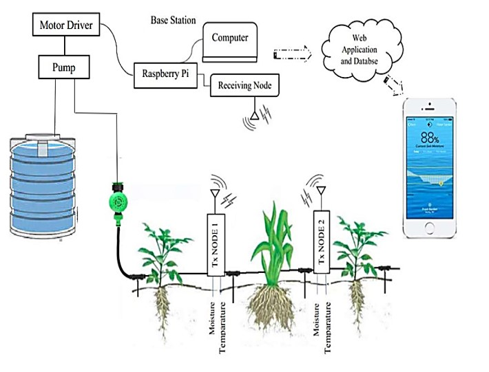
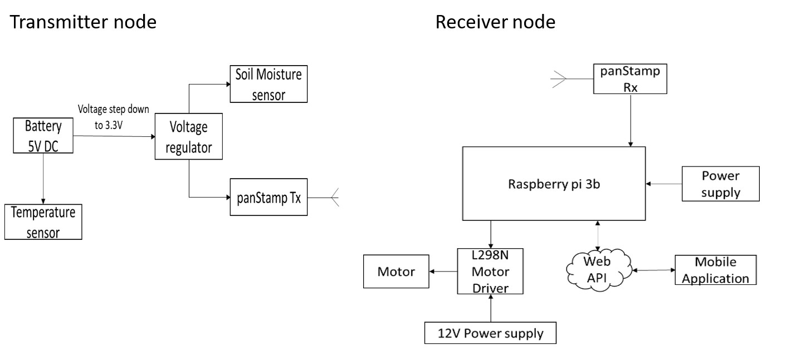

# Automated-Irrigation-System

Implementation of Automation irrigation system for a smart Home garden control, 
that can monitor, irrigate and analyze the garden remotely with the help of
Android application and Internet of Things (IoT).

The schematic represents the overview of the project.

Soil Moisture sensor and Temperature sensor are placed in the plant soil,
The panStamp transmitter collects the data and send it to the receiver via RF communication.
The data from the receiver is fed to the Raspberry Pi & to the cloud. A mobile 
application is designed to control the motor remotely. User can monitor the temperature, 
soil moisture and current weather condition in the application and decide to turn the motor
on/off. The data from the app is received by Raspberry Pi from the cloud and turn the motor 
on/off according to user command.

Overall hardware implementation of the project is shown below.

